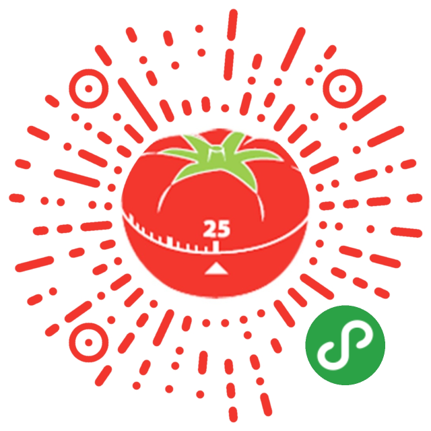

# 🍅小番茄🍅 / Tomato

## 简介 / Intro

小番茄是一款由家长使用的、针对3至12岁儿童的习惯培养的微信小程序。该小程序具备以下特点：

Tomato is a WeChat mini program designed for parents to help their children aged from 3 to 12 form better habits, featuring:

1. 本小程序允许家长对孩子的任务进行日程上的管理，并根据任务的完成情况进行积分奖励，最后孩子可使用积分从家长处兑换奖励；同时，引入“番茄工作法”概念，方便家长以量化方式对儿童的时间进行管理，记录分析孩子在做作业、读书等任务中的时间使用，逐步提高孩子的专注力。
   It helps parent arrange schedules for the kids and give them credits for accomplishing certain goals, so kids can redeem rewards using their credits. Meanwhile, we introduced Pomodoro Technique to promote children's concentration.
2. 本小程序提供儿童日常行为奖罚积分表，便于家长记录孩子的日常行为，通过积分来对孩子的行为进行正确的引导。
   It is able to record children's daily behaviors so that their credits may be added or deducted.
3. 本小程序可以通过组建班级的形式相互共享部分信息，帮助家长了解孩子在本班内的表现情况。
   A classroom-like social system is realized to share some infomation with children's peers.

## 使用

使用微信（v6.5.7+）扫描：

